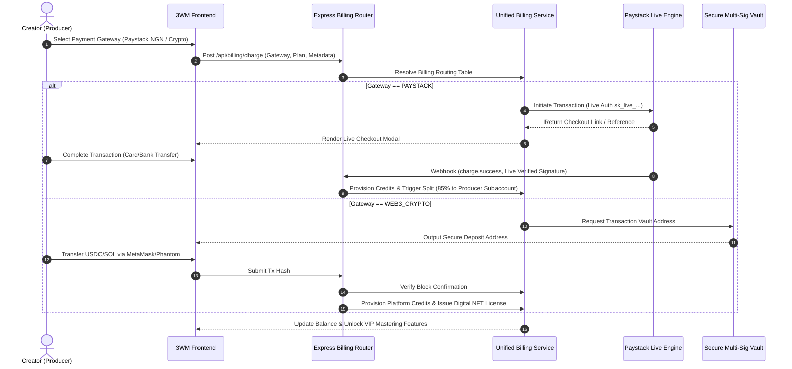

# 🔱 3WM SONIK — Architecture & Systems Specification (v3.0)

Welcome to the architectural core of **3WM SONIK**, an AI-native, high-fidelity, collaborative Music Production Operating System engineered for the Google "All Things Agentic" Hackathon.

This document provides a deep-dive specification of our multi-agent consensus protocols, real-time Web Audio rendering pipeline, multi-rail financial checkout routing, and Google Cloud BigQuery ML prediction loops.

---

## 1. Global Architectural Topology

3WM SONIK implements an **AI-to-DAW Unified State Loop** driven by the **3ONIK Multi-Agent Intelligence Engine**. Instead of treating AI as an external chatbot or passive generator, our specialized musical agents are native components of the DAW's execution thread, directly interacting with a **Shared World Model** (`SonikWorldState`).

> **"3ONIK is the brain; 3WM SONIK is the sound."**

```mermaid
graph TD
    %% Shared World Model
    SWM[("Shared World Model <br/> (SonikWorldState · Firestore & Supabase)")]

    %% Producer Block
    P[("Producer (User)")]

    %% 3ONIK Cognitive Kernel
    subgraph 3ONIK Multi-Agent Intelligence Engine
        ORCH["ThreeWM Orchestrator <br/> (Intent Parser & Task Router)"]
        EMAR["🧬 Kappachino Emar <br/> (Scientist - Mint #2AFFA3)"]
        RICKY["🔊 Kappachino Ricky <br/> (Sound God - Gold #F5A800)"]
        KINGPIN["🎙️ Kingpin <br/> (Vocal Oracle - Fire #FF3C00)"]
        COUNCIL{"Council Chamber <br/> (Deliberation & Consensus Loop)"}
    end

    %% High-Performance Sound Engine
    subgraph Audio Execution Engine (Web Audio API)
        WAC["AudioContext (48kHz DSP)"]
        SEQ["Polyrhythmic Sequencer <br/> (Step Clock)"]
        DSP["Custom DSP Nodes <br/> (Tube Saturator, EQ, Limiter)"]
        REC["Multitrack Recording Room"]
    end

    %% Multi-Rail Financial Layer
    subgraph Multi-Rail Payment Gateway
        STRIPE["Stripe Enterprise <br/> (Billing & Radar)"]
        PAYSTACK["Paystack Live Node <br/> (Account 1987626 - NGN/ZAR/KES)"]
        WEB3["Web3 Crypto Router <br/> (USDC/USDT/SOL/ETH)"]
    end

    %% Analytics & ML Layer
    subgraph Google Cloud Intelligence
        BQ_ML["BigQuery Music ML <br/> (Trend & Accent Forecasting)"]
        GEMINI["Gemini Live API <br/> (Bidirectional Voice Uplink)"]
    end

    %% Interactions
    P -->|MIDI/UI Control| SWM
    P <-->|Real-time Dialogue| GEMINI
    SWM <-->|Read/Write State| ORCH
    ORCH -->|Deconstruct Intent| EMAR & RICKY & KINGPIN
    EMAR & RICKY & KINGPIN <-->|Propose & Debate| COUNCIL
    COUNCIL -->|Consensus Commit| SWM
    SWM -->|Synchronize Tracks| WAC
    SEQ -->|Step Clock| WAC
    WAC -->|Render Stream| DSP
    REC -->|PCM Buffer| SWM
    SWM -->|Telemetry Data| BQ_ML
    BQ_ML -->|Accent Preds| SWM
    SWM -->|Usage Billing| STRIPE & PAYSTACK & WEB3
```

---

## 2. 3ONIK Multi-Agent Engine & Consensus Protocol

**3ONIK** is the proprietary AI multi-agent intelligence and audio reasoning engine that powers the 3WM SONIK operating workstation. It orchestrates a three-way specialized agent swarm supervised by the **ThreeWM Orchestrator** and validated through an asynchronous **Consensus Loop**.

```
                           [Producer Intent / Prompt]
                                       │
                           ┌───────────▼───────────┐
                           │  3ONIK Agents Engine  │
                           │ (ThreeWM Orchestrator)│
                           └───────────┬───────────┘
                                       │
             ┌─────────────────────────┼─────────────────────────┐
             ▼                         ▼                         ▼
     🧬 Kappachino Emar        🔊 Kappachino Ricky          🎙️ Kingpin
       (The Scientist)          (The Sound God)          (The Vocal Oracle)
      [Acoustics & DSP]        [Beatcraft & 808]          [Vocal Harmony]
             │                         │                         │
             └─────────────────────────┼─────────────────────────┘
                                       ▼
                           ┌───────────────────────┐
                           │  The Council Chamber  │
                           │   (Debate & Voting)   │
                           └───────────┬───────────┘
                                       │
                    [Consensus Achieved (e.g., 2/3 Vote)]
                                       │
                                       ▼
                         ┌───────────────────────────┐
                         │ Shared World Model Write  │
                         │  (Non-Destructive Snapshot)│
                         └───────────────────────────┘
```

### Agent Tool Matrix & Action Categorization

Every agent action in the DAW falls into a strict permission sandbox to prevent destructive loops:

1. **READ**: Queries the active sequencer steps, arrangement nodes, track volumes, or EQ parameters. (Low risk, execution-free).
2. **SUGGEST**: Returns recommendations inside the AI Console (e.g., "Increase 808 compression by +2.3dB").
3. **PREVIEW**: Emulates the acoustic result in real-time utilizing a secondary Web Audio node without writing to the main track.
4. **WRITE**: Generates a non-destructive state snapshot in the Firestore project database. (Automatically creates a reversible checkpoint).
5. **DESTRUCTIVE**: Deleting audio lanes or resetting sequence arrays. **Requires explicit user modal confirmation.**

---

## 3. High-Performance Audio Processing & Platform Abstraction Layer (PAL)

3WM SONIK implements a **dual-engine execution model** managed by the **Platform Abstraction Layer (PAL)** (`src/audio/platform/PlatformRegistry.ts`):

```
┌────────────────────────────────────────────────────────────────────────────────────────┐
│                                 SHARED REACT APPLICATION                               │
│        DAW Studio · Beat Lab · Mixer · Council Chamber · 3WM Agents Sidebar            │
└───────────────────────────────────────────┬────────────────────────────────────────────┘
                                            │
                                            ▼
┌────────────────────────────────────────────────────────────────────────────────────────┐
│                           PLATFORM ABSTRACTION LAYER (PAL)                             │
│                               (`src/audio/platform/`)                                  │
│   ┌───────────────────────────┐    ┌───────────────────────────┐    ┌──────────────┐   │
│   │   AudioPlatformAdapter    │    │    FileSystemAdapter      │    │ MidiAdapter  │   │
│   └─────────────┬─────────────┘    └─────────────┬─────────────┘    └───────┬──────┘   │
└─────────────────┼────────────────────────────────┼──────────────────────────┼──────────┘
                  │                                │                          │
        ┌─────────┴─────────┐            ┌─────────┴─────────┐      ┌─────────┴─────────┐
        ▼                   ▼            ▼                   ▼      ▼                   ▼
┌──────────────┐    ┌──────────────┐┌──────────────┐ ┌─────────────┐┌──────────────┐┌───────────┐
│ WebAudio     │    │ NativeAudio  ││ Browser File │ │ Desktop FS  ││ Web MIDI API ││ Hardware  │
│ Adapter      │    │ Adapter      ││ Pickers      │ │ (Node fs)   ││              ││ MIDI Ports│
└───────┬──────┘    └───────┬──────┘└──────────────┘ └─────────────┘└──────────────┘└───────────┘
        │                   │
        ▼                   ▼
┌──────────────┐    ┌──────────────────────────────────────────────┐
│ Web Audio    │    │ Electron IPC -> C++ SonikAudioEngine         │
│ AudioWorklet │    │ (ASIO / WASAPI / CoreAudio / VST3 / AU Host) │
└──────────────┘    └──────────────────────────────────────────────┘
```

### High-Performance Audio Capabilities
- **C++ WebAssembly DSP**: High-speed Wasm tape saturation (`tanh` non-linear soft clipping) & 2nd-order biquad EQ filters (`src/wasm/dsp_kernel.cpp`).
- **WebGPU Compute Shaders**: Hardware-accelerated time-domain convolution reverb & spectral FFT computation (`src/audio/webgpuDsp.ts`).
- **Lock-Free SPSC Ring Buffer**: `SharedArrayBuffer` ring buffer for zero-jitter lockless audio thread synchronization (`src/audio/worklets/ringBuffer.ts`).
- **Native C++ Engine & VST3 Host**: Multi-driver low-latency audio engine supporting ASIO, WASAPI, CoreAudio, and VST3/AU dynamic plugin discovery and execution (`native/src/SonikAudioEngine.h`, `native/src/Vst3PluginHost.h`).
- **CRDT Real-Time Collaboration**: Deterministic conflict-free state resolution via Yjs (`src/sync/ConflictResolver.ts`), offline IndexedDB persistence (`src/sync/OfflineSyncManager.ts`), and WebRTC live jamming with track edit locks (`src/sync/LiveJamEngine.ts`).
- **3ONIK Local AI Inference**: On-device neural chord generation & Afrobeat groove quantization via ONNX Runtime WebGPU (`src/agents/localInferenceEngine.ts`).
- **Production Telemetry Watchdog**: Real-time buffer underrun/xrun tracker, audio thread watchdog, and CPU sparkline diagnostics (`src/telemetry/ProductionDiagnostics.ts`).

---

## 4. Multi-Rail Financial & Universal Settlement Architecture

3WM SONIK features a flexible, robust checkout engine designed to handle both standard corporate SaaS agreements and localized/Web3 creative economies.

| Billing Option           | Provider          | Currency/Tokens                      | Target Markets                | Core Features                                                                                    |
| ------------------------ | ----------------- | ------------------------------------ | ----------------------------- | ------------------------------------------------------------------------------------------------ |
| **SaaS / Subscriptions** | Stripe            | USD ($), EUR (€), GBP (£)            | North America, Europe, Global | Automatic invoices, tiered usage billing, Radar risk scoring, Identity KYC verification.         |
| **Localized Payments**   | Paystack Live     | NGN (₦), GHS (₵), KES (KSh), ZAR (R) | Sub-Saharan Africa            | Direct mobile money wallets, immediate NIP bank transfers, regional debit cards, 85%/15% splits. |
| **Web3 Settlement**      | Coinbase / Direct | USDC, USDT, SOL, ETH                 | Decentralized Web             | Real-time multi-chain checkout routing with direct fallbacks to safe multisig vaults.            |



---

## 5. Google Cloud BigQuery ML & Data Pipeline

To analyze and predict creator activity, 3WM SONIK uses an optimized **BigQuery ML** data pipeline:

1. **Telemetry Streaming**: Real-time project sequencing events (e.g., bpm adjustments, genre select, track count, loop count) are pushed to an ingestion layer.
2. **Dataform Orchestration**: Standardizes raw sequencer telemetry schemas, removing anomalies and organizing data by Session ID.
3. **BigQuery Music ML Forecasting**:
   - Runs built-in **Time-Series Forecasting (`ARIMA_PLUS`)** to predict regional musical style trend developments (such as Amapiano or Afrobeats track count growth).
   - Runs **K-Means Clustering** to categorize creators based on loop lengths, Sequencer Step Density, and plugin preferences.
4. **Accent Prediction API**: Predictions are streamed back into the 3WM Sequencer to suggest accent steps and syncopated grooves on Step 12 and 14 for regional genres.

```
[Sequencer Activity] ──> [Firestore Telemetry] ──> [BigQuery Ingestion]
                                                           │
                                                           ▼
                                                    [Dataform SQLX]
                                                           │
                                                           ▼
                                                   [BigQuery ML Engine]
                                                ├── ARIMA_PLUS Forecasts
                                                └── K-Means User Clusters
                                                           │
                                                           ▼
                                                 [Accent Suggestion Node]
                                                           │
                                                           ▼
                                                 [Producer Sequencer]
```

---

## 6. Security Hardening Checklist

For absolute safety during production runs, 3WM SONIK implements:

- **CORS Policies**: Explicitly restricts REST endpoint queries to white-listed subdomains.
- **Helmet Headers**: Injects 12+ HTTP security-hardened headers including CSP (Content Security Policy) to protect against XSS and frame-injection.
- **Webhook Signature Verification**: Both Stripe and Paystack webhook endpoints compute SHA256 HMAC tokens with live keys to verify message authenticity before provisioning credits.
- **Secrets Management**: Environment variables are strictly sandboxed (`.env`) and never exposed to client-side bundles.

---

## 🏆 Brand Statement

**THREE WISE MEN.  
ONE VISION. THREE MINDS. INFINITE SOUND.**

BUILT FOR THE SOUND OF AFRICA. BUILT FOR THE PRODUCER. BUILT FOR THE NEXT GENERATION.  
🔱
